<!-- 加入这一段 -->

# Operating Manual

## Specifications

* **Operating Voltage:** 5V–24V
* **Trigger Types:** Start, Reverse, Turn, Brake, Daytime Running
* **Switch Modes:** APP, Remote Control, START Signal Line (Enabled), Button On

---

## Device Addition Steps

### Step 1

  Tap the **+ Add** button in the app to search for Bluetooth devices.
  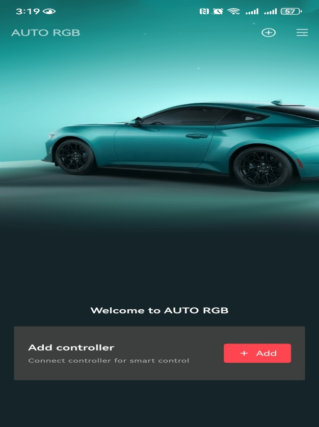

  

### Step 2

  For the first device added, create a name (e.g., `Car1`) and set a **four-digit password**. Other apps will need this password to control your vehicle.

  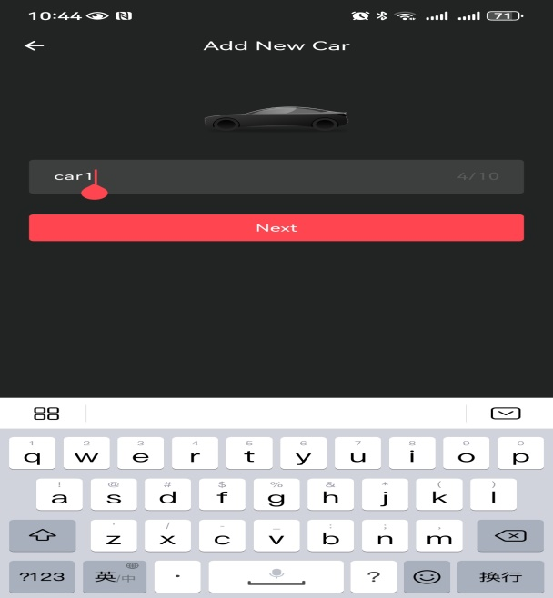

  

### Step 3

  The added controller’s LED indicator will flash **white** to indicate its assigned position. Place the controller in the corresponding location within the app. You can then add additional controllers sequentially.
  

  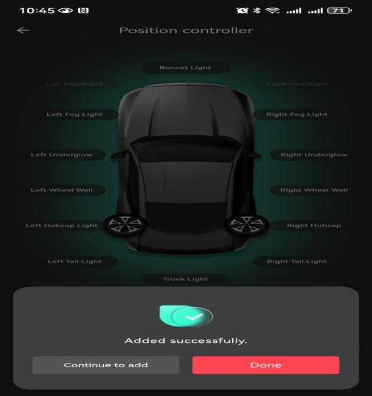

**Important Notes**

1. Only controllers of the **same type** can be added to the **left and right headlight** positions.

   Example: If the left headlight uses **MS001A**, the right headlight must also use **MS001A**.
2. Ensure all LEDs for the same vehicle location are **identical**.
3. The **first added device** becomes the **primary unit**. If the primary device fails, other devices will become **undetectable**.In this case, delete `Car1` and perform a new search to add it again.

---

## Device Deletion Steps

### Step 1
Tap **Settings** on the main interface, then tap **Reset and Delete** to remove all devices.

To delete a single device:

1. Tap **Controllers**
2. Select the device location
3. Tap **Delete**

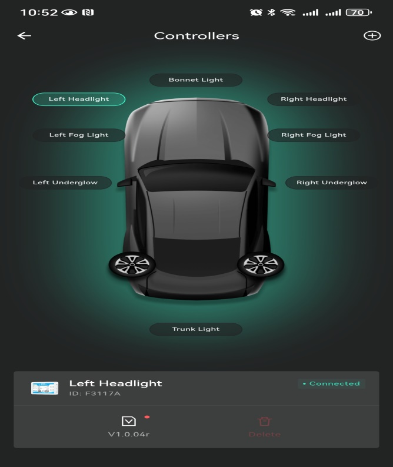

### Step 2
If the app repeatedly fails to connect to the controller, the **main controller may be damaged**.
In this case, delete the name of the Car1 vehicle; otherwise, the app will not detect any devices.

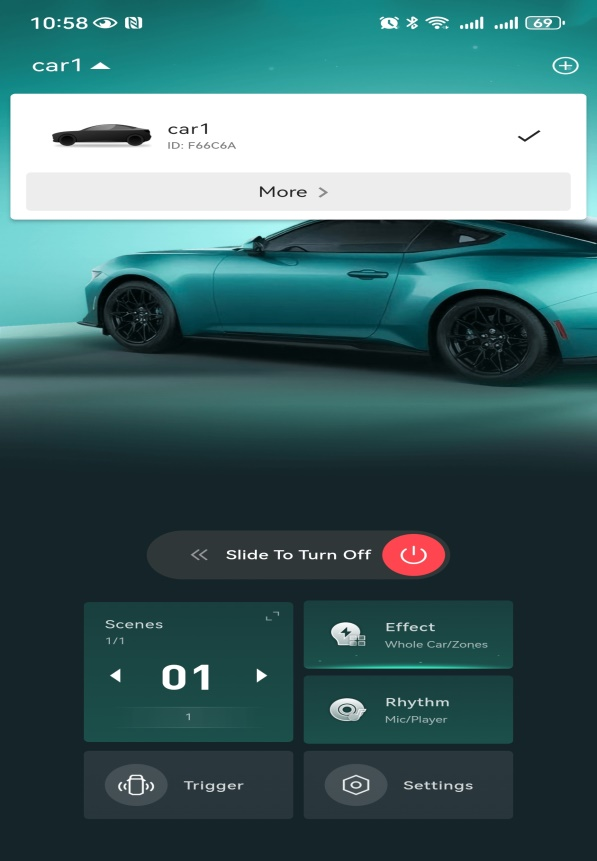

---

## Feature Overview

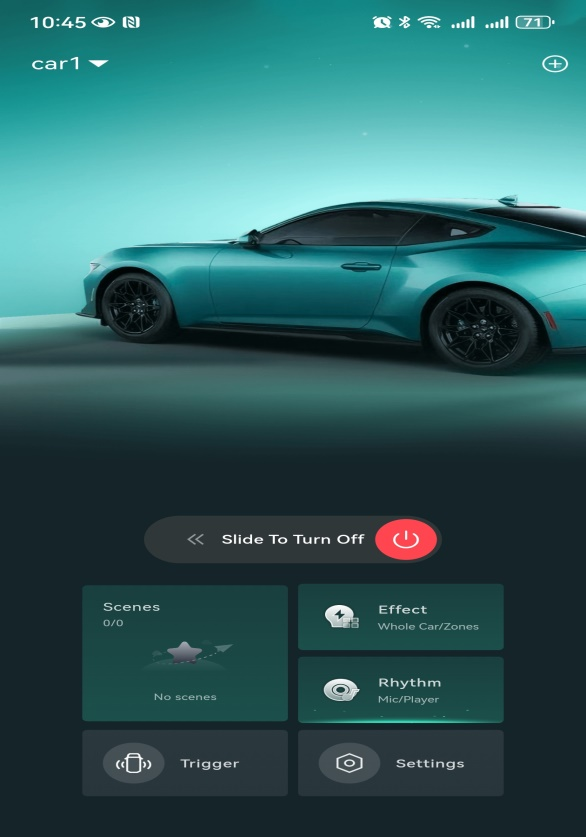

### Scenes

Save your favorite colors in this folder.

### Effect

Adjust static or dynamic colors. Also allows individual control of any light’s color.

* **Whole** — All controllers change color simultaneously
* **Zones** — Adjust colors for a specific controller
* **Solid** — Static color adjustment
* **Dynamic** — Dynamic color adjustment

### Rhythm

Music and microphone modes.

### Trigger

Trigger settings. Each headlight position can have its trigger mode set independently.

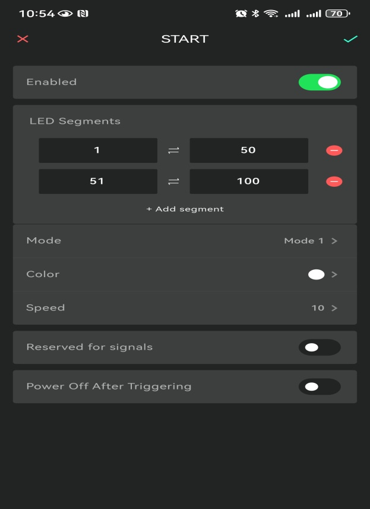

+ **Enabled**

  Disabling this function will stop the trigger signal from working.

+ **LED Segments**

  Configure three groups totaling **150 LEDs**.

  Example: `1–10`, `90–100`, `110–150`

  * Only LEDs within these segments will respond to triggers.
  * Unassigned LEDs will not trigger.
  * This setting is **not available** on **MS001B** and **MS002B** controllers.

+ **Mode**

  Adjust the trigger mode.

+ **Color**

  Configure the LED color during triggering.

+ **Speed**

  Adjust the speed of the trigger mode.

+ **Reserved for Signals**

  Locks the LED segment color setting when no trigger signal is present.

+ **Power Off After Triggering**

  * Disabled: Controller remains active after triggering ends.
  * Enabled: Controller powers off after triggering ends, unless another trigger signal activates it.

+ **Always On Display**

  * Disabled: Color-changing mode has priority over daytime mode.
  * Enabled: Daytime mode has priority over color-changing mode.

### Settings

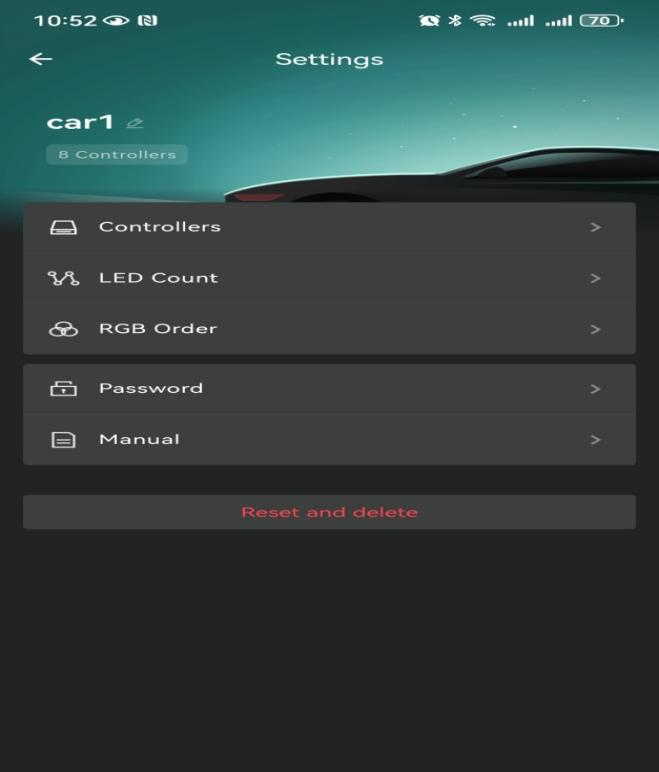

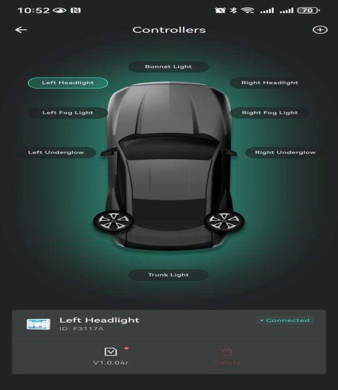

+ **Car1**

  Rename the vehicle and view the number of bound devices.

+ **Controllers**

  Upgrade or remove added controllers.

+ **LED Count**

  Set the number of LEDs on the controller.

+ **RGB Order**

  Calibrate LED color order.

+ **Password**

  Modify or disable the login password.

+ **Manual**

  Access help and instructions.

+ **Reset and Delete**

  Delete all devices and restore factory settings.

---

## External Connection Cable Overview

1. Powered by a **car battery**

   Schematic diagram showing one controller connected to one set of lights.
   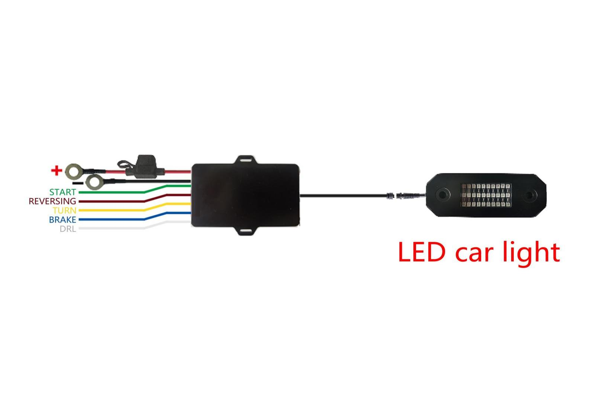

2. Vehicle battery power supply

   Schematic diagram showing one controller connected to left and right lighting set.
   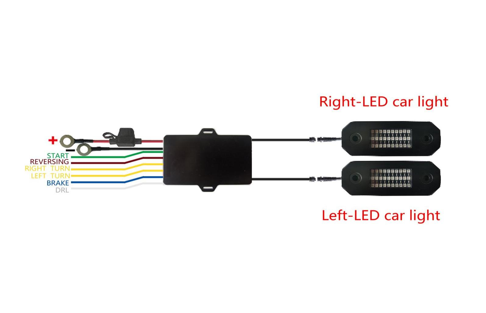

3. Trigger signal power supply.

   Schematic diagram of a controller connected to a set of light.
   